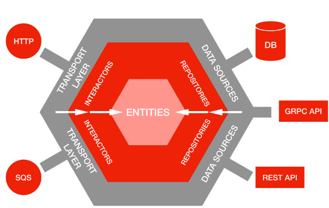

1. Iniciar Proyecto

go mod init github.com/greetings

Package for install:
1. go get github.com/joho/godotenv
2. go get -u github.com/gin-gonic/gin
3. go get go.mongodb.org/mongo-driver/mongo


Buenas practicas:
Poner el tiempo en UTC
```
player.CreationTime = time.Now().UTC()
```

RAMAS CREADA HASTA EL MOMENTO PARA CREAR LA ARQUITECTURA HEXAGONAL:
1. conect/db-mongo
2. handler/como-se-conforma
3. init/gin
4. init/project-go
5. main
6. mongodb/capa-ports-arq-hexagonal
7. ports/separando-service-and-folder-ports
8. ultima-capa-conexion-db


Crear Carpeta

cmd/
cmd/api/
cmd/api/main.go

cmd/api/handlers/player/
cmd/api/handlers/player/create.go
cmd/api/handlers/player/handler.go

internal/
internal/domain/player.go
internal/ports/player.go

internal/repositories/
internal/repositories/mongo/player/insert.go
internal/repositories/mongo/player/repository.go
internal/repositories/mongo/connect_client.go

internal/services/player/create.go
internal/services/player/service.go

# CAPAS ARQUITECTURA HEXAGONAL

# Entities (Entidades)
# Estas son las entidades del dominio que representan el núcleo de la lógica de negocio
```
internal/domain/player.go
```

# Interactors (Interactores o Servicios de aplicación)
# Son los servicios que orquestan la lógica de negocio y las interacciones con las capas externas (adaptadores)
```
internal/services/player/
```

# Transport Layer (Capa de Transporte o Adaptadores de Entrada)
# Aquí se manejan las entradas al sistema (solicitudes HTTP, mensajes SQS, etc.). Corresponde a los handlers que definen cómo se manejan las solicitudes HTTP o entradas de otros tipos, como los mensajes en cola.
```
cmd/api/handlers/player/
```

# Repositories (Repositorios o Adaptadores de Salida)
# Aquí se encuentran las implementaciones que permiten la interacción con fuentes de datos externas (como bases de datos o APIs externas)
```
internal/repositories/mongo/
```

# Data Sources (Fuentes de Datos)
# Estas son las bases de datos u otras APIs externas (REST API, gRPC, etc.)

internal/repositories/mongo/

